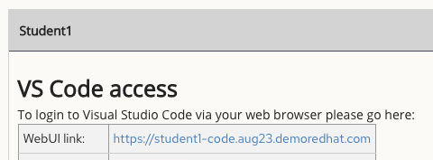

# network_demos
This repository includes several "ready to go" Ansible automation demos for multi-vendor networking. Please note, these demos are intended for Red Hat employees and require a RHDP reservation for an aap2-workshop-networking-automation POD https://demo.redhat.com/catalog?search=network&item=babylon-catalog-prod%2Fansiblebu.aap2-workshop-networking-automation.prod

For inteterested customers, please contact your Red Hat account team for a live demo. Alternatively, youtube video links of the demos are included in each demo README file.

Upon receiving a POD environment, please scroll down directly to the `Getting Started` steps or click below.
- [Getting Started](#getting-started)

## Menu of Demos
For the below demos insure you are always using files from /home/student/network-demos-repo/
- [Network Backups GIT](network_backups_git/README.md)
   * Validated Content: network.backup 
   * Self Service Survey
   * Intended config "configuration drift"
   * Restore Configs
- [Network Compliance Dashboard](network_compliance_dashboard/README.md)
   * Network Facts
   * JINJA2 HTML template
- [Network Compliance Checks Remediations](network_compliance_checks_remediations/README.md)
   * Network Resource Modules
   * Workflows
   * Self Service Survey
   * Check Mode/Run Mode (ntp,snmp,logging,and acls)
   * Handlers
   * Cisco STIG
- [Scoped Configuration Management](scoped_configuration_management/README.md)
   * Validated Content: `network.base` 
   * Operations: Persist, Deploy, Detect, Remediate
   * BGP
- [Completed Ansible Network Automation Workshop 101 Demo ](completed_ansible_network_automation_workshop_101_demo/README.md)
   * Network Backups and Restore to a server
   * Network User
   * Network Banner
   * Workflow
   * Self Service Survey
- [Network Access List](network_access_list/README.md)
- [Network SNOW](network_snow)
- [Cisco ACI](cisco_aci)
- [Cisco DNAC](cisco_dnac)
   * TBD
   
# Getting Started

## Summary of steps
The following steps only take a few minutes to prep all the demos.
1. wget https://gitlab.com/redhatautomation/network_demos/-/raw/main/gitea/gitea.yml
2. ansible-navigator run -m stdout gitea.yml
3. setup VSCode for git
4. Add your student pod password and run the following command from `network-demos-repo/`
~~~
 ansible-navigator run controller_as_code/setup.yml -m stdout -e "username=gitea git_password=gitea password=<replace-with-lab-student-password>"
~~~
5. update your git by commiting the changes to the local directory.

## Exercise 1 - Setting up the Gitea Repo and VSCode

## Table of Contents

- [Exercise 1 - Setting up the Gitea Repo and VSCode](#exercise-1---seting-up-the-gitea-repo-and-vscode)
  - [Table of Contents](#table-of-contents)
  - [Objective](#objective)
  - [Diagram](#diagram)
  - [Guide](#guide)
    - [Step 1 - Connecting via VS Code](#step-1---connecting-via-vs-code)
    - [Step 2 - Using the Terminal](#step-2---using-the-terminal)
    - [Step 3 - Deploy Gitea on the Control Node](#step-3---deploy-gitea-on-the-control-node)
    - [Step 4 - Open the project directory in Visual Studio Code](#step-4---open-the-project-directory-in-visual-studio-code)
    - [Step 5 - Create and check in to your repo](#step-5---create-and-check-in-to-your-repo)
  - [Complete](#complete)

## Objective

This exercise will set up your environment for the remaining demos included in this repository. This exercise includes steps to set up a version control system, which is used to track and provide control over changes made to the automation code. Version control (sometimes called source control) plays an important role in any development project, including automation development. This repository will be used with both the command line utilities and when we use the Ansible Automation Platform.

## Diagram


## Guide

### Step 1 - Connecting via VS Code

<table>
<thead>
  <tr>
    <th>You must use Visual Studio Code to setup the demos. Visual Studio Code provides:
    <ul>
    <li>A file browser</li>
    <li>A text editor with syntax highlighting</li>
    <li>A in-browser terminal</li>
    </ul>
    Direct SSH access is available as a backup, or if Visual Studio Code is not sufficient to the student.  There is a short YouTube video provided if you need additional clarity: <a href="https://youtu.be/Y_Gx4ZBfcuk">Ansible Workshops - Accessing your workbench environment</a>.
</th>
</tr>
</thead>
</table>

- Connect to Visual Studio Code from the Workshop launch page (provided by Red Hat RHDP).  The password is provided below the WebUI link.

  

- Type in the provided password to connect.

  


### Step 2 - Using the Terminal

- Open a terminal in Visual Studio Code (VSC):

  

### Step 3 - Deploy Gitea on the Control Node

We are going to run our first playbook here, which will deploy a Gitea server in a container on the control node (ansible-1).

In the VSC terminal, use wget to download the gitea.yml file, and then use `ansible-navigator` to run the playbook.
```
wget https://gitlab.com/redhatautomation/network_demos/-/raw/main/gitea/gitea.yml
```
You can run the ansible-navigator command with low verbosity, or if you want to see more of what Ansible is doing, you can add `-v` (up to 4 v's) to the ansible-navigator command.
```bash
ansible-navigator run -m stdout gitea.yml
or 
ansible-navigator run -m stdout gitea.yml -v

```
Running the gitea.yml playbook will output to the terminal all of the tasks that are done to deploy the Gitea container, configure it for use in the environment, and setup the network-demos-repo that we will be working out of.  When the playbook has finished running, you should be able to change into the network-demos-repo directory and run git status to see that we are up today.
```
cd network-demos-repo
git status
```

### Step 4 - Open the project directory in Visual Studio Code

Click on the files icon in the upper right corner of your Visual Studio Code window, and click `Open Folder`.


In the pop-up window, choose the `/home/student/netowrk-demos-repo` folder, and select `OK`.

 
## Exercise 2: Controller as Code

## Table of Contents
- [Step 1 - Variables](#step-1-variables)
- [Step 2 - Using the Terminal](#step-2-using-the-terminal)
- [Step 3 - Run Playbook](#step-3-run-playbook)
- [Step 4 - Commit to git](#step4-commit-to-git)
- [Step 5 - Examine the Ansible Controller configuration](#step-5-examine-the-ansible-controller-configuration)

## Objective

In this exercise you will use the ansible.controller collection to configure the AAP Controller. You will utilize the VSCode as part of your student workshop environment. By modifify and running a playbook from the ansible-navigtor CLI, we can avoid the AAP Controller GUI to configure additional elements needed for the subsequent demos. 

### Step 1 - Variables

- Connect to Visual Studio Code from the Workshop launch page (provided by your instructor).  The password is provided below the WebUI link.

  

- Type in the provided password to connect.

  

1. Open the `network-demos-repo` directory in the browser tab for Visual Studio Code and navigate to open setup.yml:
2. File Explorer - Open folder -> /network-demos-repo/
3. Locate and review the /controller-as-code/setup.yml
4. Examine the playbook tasks

### Step 2 - Run Playbook 
The setup.yml playbook will require extra variables when running in ansible-navigator.

- The CONTROLLER_PASSWORD in setup.yml is the same password assigned to your RHDP student POD for the Ansible Controller

Run the `ansible-navigator` command with the `run` argument and -m stdout as well as  -e for the `--extra-vars`

  ~~~
  $ ansible-navigator run controller_as_code/setup.yml -m stdout -e "username=gitea git_password=gitea password=<replace-with-lab-student-password>"
  ~~~

#### Output "truncated"
The first run will show 'changed'
```bash
PLAY [Playbook to configure ansible controller] ********************************

TASK [Gathering Facts] *********************************************************
ok: [localhost]

TASK [Create projects] *********************************************************
ok: [localhost]

TASK [Add group] ***************************************************************
ok: [localhost]

TASK [Add group] ***************************************************************
ok: [localhost]

TASK [Add group] ***************************************************************
ok: [localhost]

TASK [Create Execution Environments] *******************************************
ok: [localhost]

TASK [Gitea Credential Type] *******************************************************
ok: [localhost]

 TASK [Gitea Credential] *******************************************************
ok: [localhost]
```
### Step 4 Commit to git
click on the Git button on the left side of the window (third down - see picture).  You will see in the Git window that there is a change to be committed.


Add in a message such as "this is just a test" and click `Commit`.  The button will change to `Sync Changes`.  Click this, and if you have set up your remote settings correctly, it will sync your change to your remote (Gitea).  If this didn't work, review the earlier steps, or ask your instructor for help.

### Step 5 Access the AAP Controller

Access your AAP from the https://xxxxx.example.opentlc.com/ link. 
- Your link is int RHDP pod information.

Your AAP Controller should now include the job-templates etc for the menu of demos. You can now select a demo from the Menu of Demos and follow the specific directions in the README.md.

## Return to Demo Menu
 - [Menu of Demos](#menu-of-demos)

