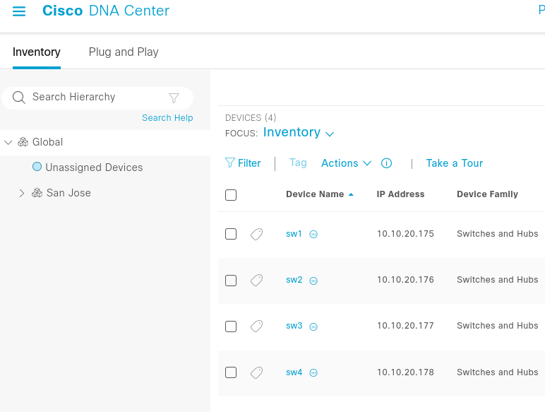

## Return to Demo Menu
 - [Menu of Demos](../README.md)

# Cisco DNAC 

## Table of Contents
- [Step 1 - Review DNAC GUI](#step-1-review-dnac-gui)
- [Step 2 - DNAC-Config-Retrieve job-template](#step-2-using-the-terminal)
- [Step 3 - Review Backups](#step-3-review-backups)
- [Step 4 - Dnac-Compliance job-template ](#step-4-dnac-compliance-job-template)

# Summary of steps
1. Review the Current Cisco Devnet Always On DNAC Network Device Inventory 
`https://sandboxdnac.cisco.com user=devnetuser password=Cisco123!`
2. Launch the DNAC-Config-Retrieve job-template and select the devices Sw1-4 that were gleaned from the dnac_dynamic inventory source
3. Review the config backups that are saved to the gitea main branch with timestamps.
`cisco_dnac/backups`
4. Launch the Dnac-Compliance job-template to check if hte current Device Software Versions are in compliance.

## Objective
Demonstrate Ansible working `Better Together` with Cisco DNAC by saving the DNAC device configuration backups to a git repository. The Git repo is foundational for infrastucture as code and offers a method for managing single source of truth and configuration drift "diff" checks. The second part of the demo highlights AAP's ability to glean device information from DNAC to use for easy to impliment compliance checks.
## Overview
In this demo we will check configurations from DNAC `Catalyst Center` as a Single Source of truth for Ansible. In turn we can reconcile any confiuration drift before making changes originated in AAP or DNAC. In the second part of the demo we use DNAC device information for compliance checks or optionally pass DNAC config datato other CMDB systems etc.

## Devnet DNAC Sandbox
The hosts.yml file in this demo can be modified to run in the Cisco Devnet always on or reserved sandboxes. The latter requires a vpn connection.

### Always On:
dnac_server: https://sandboxdnac.cisco.com
dnac_username: devnetuser
dnac_password: Cisco123!

## Step 1 - Review DNAC GUI
1. Review the Current Cisco Devnet Always On DNAC Network Device Inventory 
`https://sandboxdnac.cisco.com user=devnetuser password=Cisco123!`

## Step 2 - DNAC-Config-Retrieve job-template
1. Launch the DNAC-Config-Retrieve job-template and select the devices Sw1-4 that were gleaned from the dnac_dynamic inventory source

## Step 3 - Review Backups
1. Use VSCode terminal to review the Device Backups that were pushed to GIT
Pull from gitea
~~~
$ git pull
~~~
Review Backup Files
~~~
[student@ansible-1 network-demos-repo]$ ls cisco_dnac/backups/
sw1_2024-01-2922:34:55.cfg  sw2_2024-01-2922:35:00.cfg  sw3_2024-01-2922:35:04.cfg  sw4_2024-01-2922:35:08.cfg
~~~
~~~
[student@ansible-1 network-demos-repo]$ cat cisco_dnac/backups/sw1_2024-01-2922:34:55.cfg
 
 Building configuration...
 
 Current configuration : 8408 bytes
 !
 ! Last configuration change at 17:25:15 UTC Tue Dec 19 2023
 !
 version 17.9
 service timestamps debug datetime msec
 service timestamps log datetime msec
 service callhome
 platform puntkeepalive disablekernelcore
 !
 hostname sw1
~~~
Truncated

## Step 4 - Dnac-Compliance job-template 
Launch the Dnac-Compliance job-template to check if the current Device Software Versions are in compliance.

### Note, if compliance fails
Please be aware that the version of the dnac switch devices may change over time. If needed you can edit the compliance_assert.yml if needed.

Example output:
~~~
TASK [Current Device Info] *****************************************************
ok: [dnac_server] => {
    "msg": [
        "Hostname: sw1",
        "DeviceID: 32446e0a-032b-4724-93e9-acbbab47371b",
        "SerialNumber: ['9SB9FYAFA2O']",
        "HardwareType: Cisco Catalyst 9000 Series Virtual Switches",
        "Software version: 17.9.20220318:182713"
    ]
}
TASK [Compliance Check "assertion"] ********************************************
ok: [dnac_server] => {
    "changed": false,
    "msg": "sw1 Software version is compliant"
}
~~~

# Key Takeaways
* Cisco DNAC and Ansible are better togehter!

## Return to Demo Menu
 - [Menu of Demos](../README.md)

