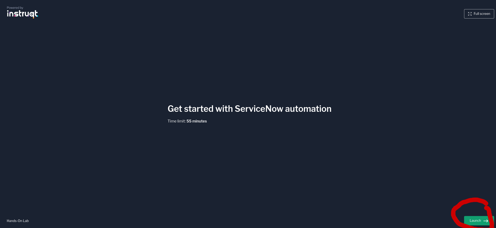
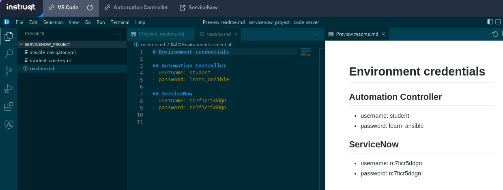

## Return to Demo Menu
 - [Menu of Demos](../README.md)

# Summary of steps
1. Connect to Netbox Demo server to create and copy an API token
https://netbox-demo.netboxlabs.com/ user=admin pass=admin
2. Launch the Network-Netbox-Setup Workflow Template to configure a device and settings on Netbox
3. Review the Netbox GUI (devices, templates etc)
3. Add the API Token to Netbox inventory source to synch with Netbox as a dynamic inventory
4. Review the Netbox Inventory on AAP
5. Launch the Network-Netbox-Facts job-template to demonstrate using the Inventory for rtr1
6. Launch the Network-Netbox-Compare-Configs job-template to compare the running config t the netbox config.
7. Verify Config drift checks by changing the config on rtr1

# Netbox

[Table of Contents](#table-of-contents)
- [Step 1 - Persist](#step-1-persist)
- [Step 2 - Deploy](#step-2-deploy)
- [Step 3 - Detect](#step-3-detect)
- [Step 4 - Remediate](#step-4-remediate)

## Objective
To integrate Ansible with Netbox as a single source of truth (SSOT)

## Overview
The netbox.netbox collection allows Ansible to manage Netbox easily from the API. In this demo we use Ansible to check for config drift from routers config managed via Netbox. 

### Step 1 - SNOW user/pass
Launch a new instruqt lab instance instance.
https://play.instruqt.com/embed/redhat/tracks/getting-started-servicenow-automation?token=em_5ktpLJWtzpbqcDyM

1. Launch

2.Wait for about 4 minutes 

### Step 2 - Collect user/pass
1. Access the VSCode README.md file to copy the SNOW user/pass for a SNOW instruqt session.

# Key Takeaways
* 
## Return to Demo Menu
 - [Menu of Demos](../README.md)