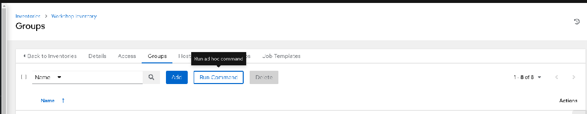
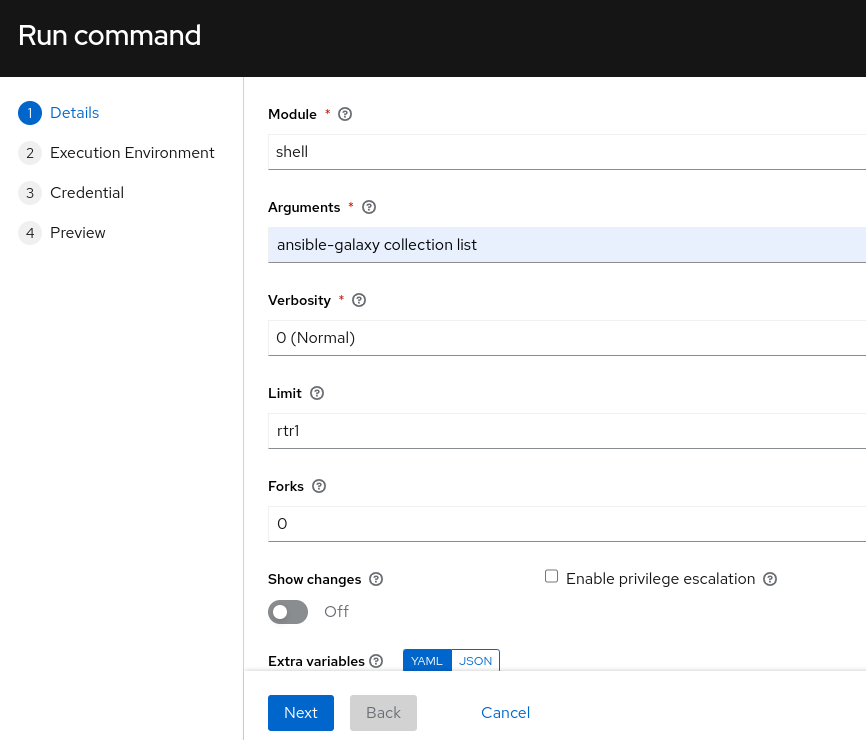
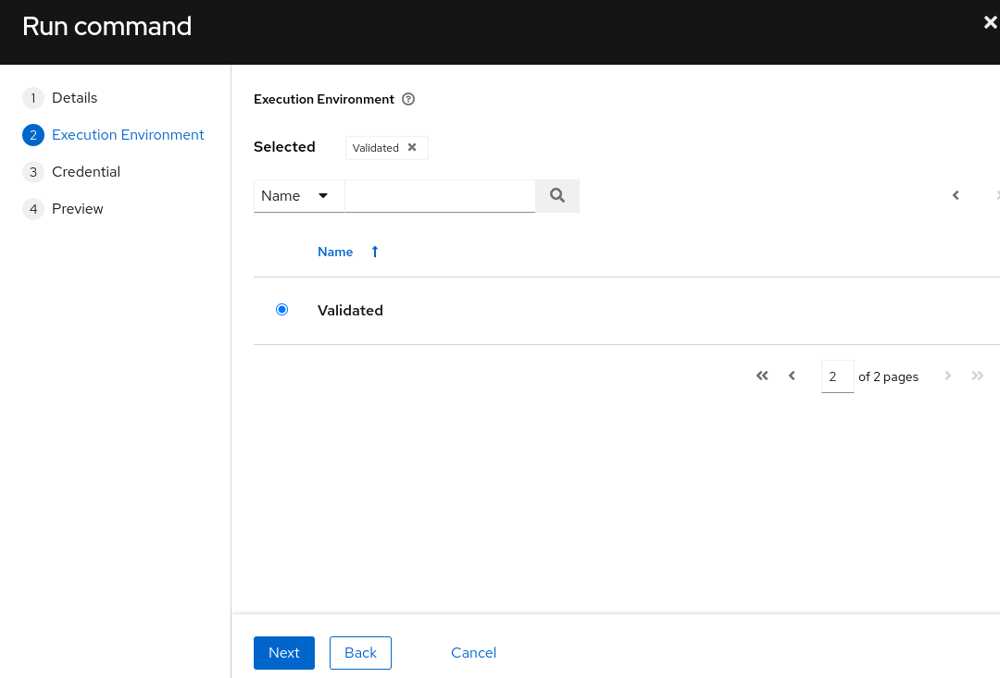
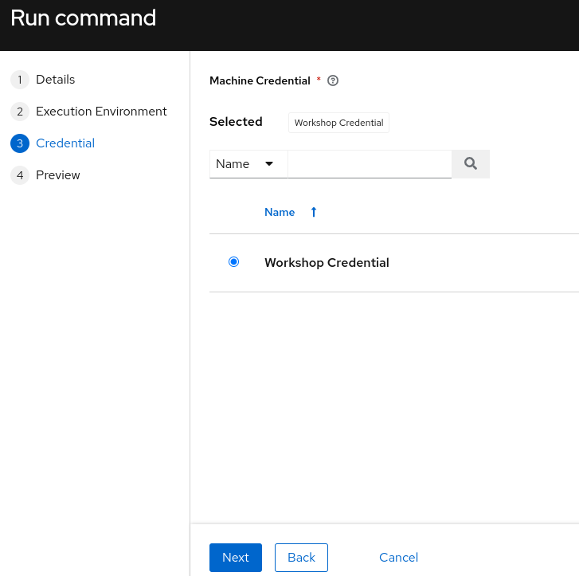
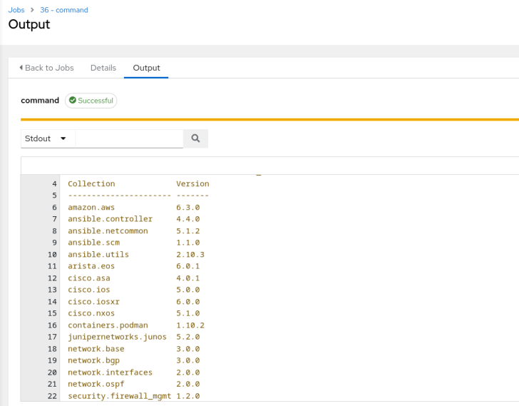

## Return to Demo Menu
 - [Menu of Demos](../README.md)

# Summary of steps
## Adhoc
1. Demonstrate how to display the installed collections in an execution environment (EE)
2. Demonstrate running adhoc commands on routers

## Step 1 - Demonstrate Collection List
1. In the AAP Controller adhoc commands can be ran from an inventory group. In the below example we will limit the command to rtr1 from the group since we are actually running the command from the shell on the execution environment container, not the router, when `running` an adhoc command.

2. Navigate to inventory/groups to run adhoc commands form the AAP controller. Notice the run command button below.
 
3.  Use the shell command module to run commands similar to the CLI `ansible-galaxy collection list` will display the installed collections for an EE
4. Limit to a single device in the inventory to save time
 
5. Select an execution environment. This EE includes the network.base collection
 
6. Select a credential
 
7. Run the adhoc command and locate the network.base in the output.
 

 ## Step 2 - Demonstrate Adhoc Router Commands

