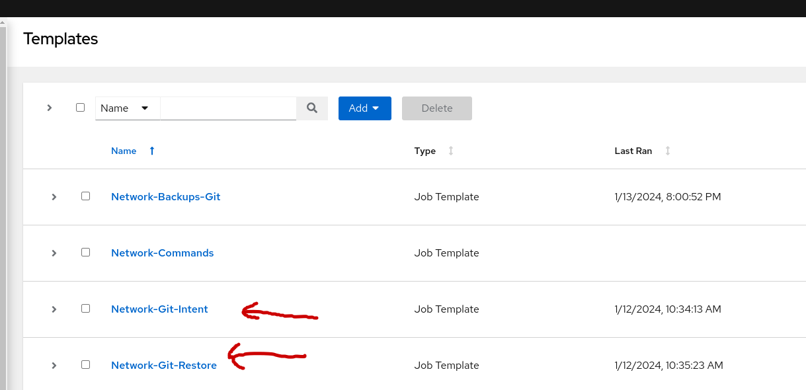
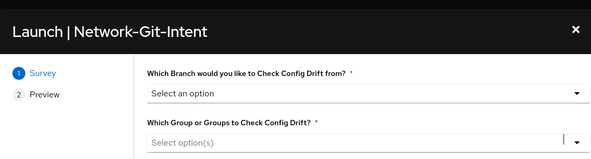
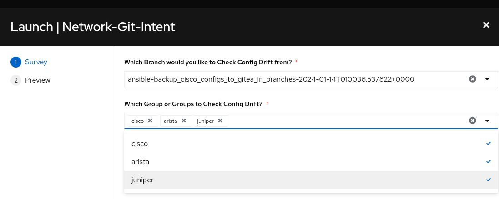
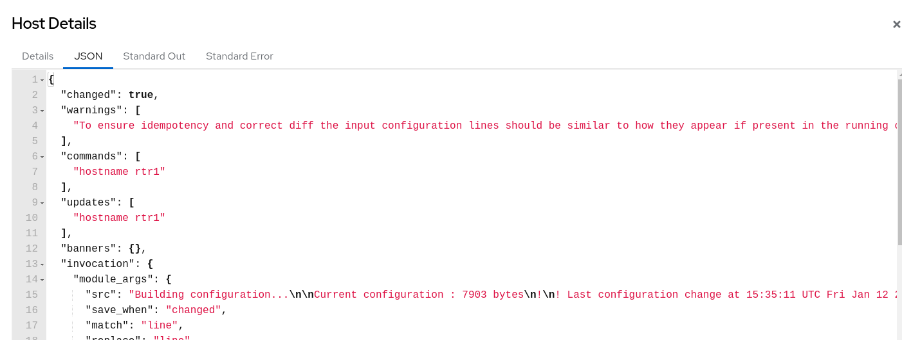

## Return to Demo Menu
 - [Menu of Demos](../README.md)

# Summary of steps
1. Collect Backup configurations from routers and save them to Gitea branches
2. Verify Branches in local GIT CLI `git checkout` or with the optional Gitea GUI
3. Modify the Routers from the CLI
4. Verify Job-template(s) exist
5. Launch the Network-Intended Job-Template
6. Review the Diff between the backup up configs and the running configs on the routers
7. Launch the Network Restore Job Template
8. Verify how the retore will merge the running configuration back to the original

# Network Backups GIT

[Table of Contents](#table-of-contents)
- [Step 1 - Collect Backup Configurations](#step-1---credential)
- [Step 2 - Review](#step-2---job-template)

## Objective
To enable multi-vendor router configuration backups to Gitea and subsequently the restoral of them as needed. We will also explore managing configuration drift in this demo.

## Overview
This demo uses the ansible.scm collection and the network.backup role from Validated Content `network.backup` to backup router configurations to git branches in Gitea. Additionally we will check for configuration drift and restore configurations when appropriate.

### Step 1 - Collect Backup Configurations
Access your AAP Controller from your RHDP POD and run the 'Network-Backups-Git' job template. The survey prompt allows for custom naming your branch or default branch naming when ignored. 

Output - Network-Backups-Git `backups.yml` with explanations
```
Identity added: /runner/artifacts/404/ssh_key_data (/runner/artifacts/404/ssh_key_data)

PLAY [Backup Cisco Configs to Gitea in Branches] *******************************

TASK [Retrieve a repository from a distant location and make it available to the local EE] ***
changed: [localhost] 
```
`The above task uses `ansible..scm.git_retrieve` to clone the network-demos-rep from the gitea repository to the execution environment`
```
TASK [Network Backup and Resource Manager] *************************************
```
`The following tasks are run using the network.backup.run role. Note that the tasks are accessed from the path (/usr/share/ansible/collections/ansible_collections/network/backup/roles/). This path refers to the validated collection that was installed into the execuion environment.`
```
TASK [network.backup.run : Include tasks] **************************************
included: /usr/share/ansible/collections/ansible_collections/network/backup/roles/run/includes/validation.yaml for rtr1, rtr2, rtr4, rtr3

TASK [network.backup.run : Set supported platform list] ************************
ok: [rtr1]
ok: [rtr3]
ok: [rtr4]
ok: [rtr2]

TASK [network.backup.run : Run the platform specific tasks] ********************
included: run/includes/backup.yaml for rtr1, rtr2, rtr4, rtr3 => (item=/usr/share/ansible/collections/ansible_collections/network/backup/roles/run/includes/backup.yaml)

TASK [network.backup.run : Build Local Backup Dir Path] ************************
included: /usr/share/ansible/collections/ansible_collections/network/backup/roles/run/includes/path.yaml for rtr2, rtr1, rtr4, rtr3

TASK [network.backup.run : Set local backup path] ******************************
ok: [rtr4]
ok: [rtr1]
ok: [rtr2]
ok: [rtr3]

TASK [network.backup.run : Include tasks] **************************************
included: /usr/share/ansible/collections/ansible_collections/network/backup/roles/run/includes/network.yaml for rtr1, rtr2, rtr4, rtr3

TASK [network.backup.run : Invoke backup task] *********************************
included: /usr/share/ansible/collections/ansible_collections/network/backup/roles/run/includes/cli_backup.yaml for rtr1, rtr2, rtr4, rtr3

TASK [network.backup.run : configurable backup path] ***************************
changed: [rtr1]
changed: [rtr3]
changed: [rtr2]
changed: [rtr4]
```
`The above backup path is defined in the backup.yml playbook`
```
TASK [Publish the changes] *****************************************************
changed: [localhost]
```
`The above task will push the backup files from the EE to the Gitea repository`
```
PLAY [Prepare Branches for Intent and Restore] *********************************
```
`The above play will create/edit two job-templates (intended,restore) in the AAP controller`
```
TASK [Retrieve a repository from a distant location and make it available to the local EE] ***
changed: [localhost]

TASK [List the Branches] *******************************************************
changed: [localhost]

TASK [Create a job-template - Network-Git-Intent] ******************************
changed: [localhost]

TASK [Create a job-template - Network-Git-Restore] *****************************
changed: [localhost]

PLAY RECAP *********************************************************************
localhost                  : ok=6    changed=6    unreachable=0    failed=0    skipped=1    rescued=0    ignored=0   
rtr1                       : ok=8    changed=1    unreachable=0    failed=0    skipped=11   rescued=0    ignored=0   
rtr2                       : ok=8    changed=1    unreachable=0    failed=0    skipped=9    rescued=0    ignored=0   
rtr3                       : ok=8    changed=1    unreachable=0    failed=0    skipped=9    rescued=0    ignored=0   
rtr4                       : ok=8    changed=1    unreachable=0    failed=0    skipped=9    rescued=0    ignored=0   
```
### Step 2 - Review Branches
Note, you can use the gitea gui/web as an alternative to the following git cli instructions.
Simply open a tab and paste in your lab url and modify it to append `/gitea`
```
https://student1.hjjzl.example.opentlc.com/gitea
user= gitea
password = gitea
repo= https://student1.hjjzl.example.opentlc.com/gitea/gitea/network-demos-repo
```  
#### Git CLI
1. In VSCode terminal `network_backups_git/`
~~~
$ git branch -r
~~~

example output:
~~~
[student@ansible-1 network-demos-repo]$ git branch -r
  origin/ansible-backup_cisco_configs_to_gitea_in_branches-2024-01-29T173838.717897+0000
  origin/master
~~~

- Navigate to the network_backup_files folder and review the router config files.

### Checkout branch in vscode terminal
~~~
[student@ansible-1 network-demos-repo]$ git checkout ansible-backup_cisco_configs_to_gitea_in_branches-2024-01-29T173838.717897+0000
branch 'ansible-backup_cisco_configs_to_gitea_in_branches-2024-01-29T173838.717897+0000' set up to track 'origin/ansible-backup_cisco_configs_to_gitea_in_branches-2024-01-29T173838.717897+0000'.
Switched to a new branch 'ansible-backup_cisco_configs_to_gitea_in_branches-2024-01-29T173838.717897+0000'
~~~
### List the network_backup_files to the branch
~~~
[student@ansible-1 network-demos-repo]$ ls network_backup_files/
rtr1.txt  rtr2.txt  rtr3.txt  rtr4.txt
~~~
### Cat a config file to review
~~~
[student@ansible-1 network-demos-repo]$ cat network_backup_files/rtr1.txt 
Building configuration...

Current configuration : 7798 bytes
!
! Last configuration change at 15:57:02 UTC Mon Jan 29 2024 by ec2-user
!
version 17.6
service timestamps debug datetime msec
service timestamps log datetime msec
~~~
Truncated

### Checkout main branch
It's important to return to the main branch !!!!!!!
~~~
$ git checkout main
~~~

# Network Intended GIT

[Table of Contents](#table-of-contents)
- [Step 1 - Modify the Routers](#modify-the-routers)
- [Step 2 - Verify the new Job-templates](#verify-the-new-job-templates)
- [Step 3 -  Launch the Network-Intended Job-template](#launch-the-network-intended-job-template)

## Overview
In this portion of the demo we have a backup file(s) saved for each router in the Gitea repository. We will now make a change to some of the same routers using out of band OOB management and the CLI to demonstrate configuration drift. By using the saved router configurations from a particular branch we can detect that the router configuraion has drifted away from our single source of truth as understood by Ansible.


### Step 1 - Modify the Routers
1. Modify rtr1's hostname. 
rt1 is a Cisco router. Access the router from the VSCode terminal window
~~~
ssh rtr1
config t
hostname mistake
exit
exit
~~~
Output:
~~~
[student@ansible-1 test]$ ssh rtr1
rtr1#config t
Enter configuration commands, one per line.  End with CNTL/Z.
mistake(config)#hostname mistake
mistake(config)#exit
mistake#exit
~~~
2. Modify rtr3's hostname. 
rt3 is a Juniper router. Access the router from the VSCode terminal window
~~~
ssh rtr3
configure 
set system host-name oooops 
commit 
exit 
exit
~~~
Output:
~~~
[student@ansible-1 test]$ ssh rtr3
Last login: Sun Jan 14 01:00:42 2024 from 3.147.126.29
--- JUNOS 22.3R2.12 Kernel 64-bit XEN JNPR-12.1-20221212.98a33a0_buil
ec2-user@rtr3> configure 
Entering configuration mode
[edit]
ec2-user@rtr3# set system host-name oooops 
[edit]
ec2-user@rtr3# commit 
commit complete
[edit]
ec2-user@oooops# exit 
Exiting configuration mode
~~~

### Step 2 - Verify the new Job-templates
Th
e intended and restore job-templated were previously created from the backups.yml playbook. 
Access the AAP Controller.


### Step 3 - Launch the Network-Intended Job-template
Upon lauching the job-template the self service survey will prompt for information.


1. Select the branch from the dropdown. There will be multipl choices, if you have ran the Network Backups Job Template more than once.Do not select the master branch because it contains no backup files. Normally the latest backup branch is the selection just above the master branch. This can be verified with the Gitea webpage. You must also slect the groups of devices to run the config drift check against. Go ahead and select all three eventhough we didn't modify the arista devices.

 

 2. Review the output to understand the Diff entries for the hostname changes in rtr1 and rtr3.
 ~~~

TASK [Diff against cisco ios configuration] ************************************
--- before
+++ after
@@ -6,7 +6,7 @@
 platform qfp utilization monitor load 80
 platform punt-keepalive disable-kernel-core
 platform console virtual
-hostname mistake 
+hostname rtr1
 boot-start-marker
 boot-end-marker
 vrf definition GS
changed: [rtr1]
TASK [Diff against arista eos configuration] ***********************************
ok: [rtr2]
ok: [rtr4]
TASK [Diff against juniper junos configuration] ********************************
[edit system]
-  host-name oooops;
+  host-name rtr3;
changed: [rtr3]
PLAY RECAP *********************************************************************
rtr1                       : ok=2    changed=2    unreachable=0    failed=0    skipped=2    rescued=0    ignored=0   
rtr2                       : ok=1    changed=0    unreachable=0    failed=0    skipped=2    rescued=0    ignored=0   
rtr3                       : ok=1    changed=1    unreachable=0    failed=0    skipped=2    rescued=0    ignored=0   
rtr4                       : ok=1    changed=0    unreachable=0    failed=0    skipped=2    rescued=0    ignored=0   
 ~~~

 3. Verify that the intended.yml simply displays the Diff but does not actually modify the router configurations.

 ~~~
 [student@ansible-1 test]$ ssh rtr1
mistake#
mistake#exit
[student@ansible-1 test]$ ssh rtr3
Last login: Sun Jan 14 01:45:54 2024 from 3.147.126.29
--- JUNOS 22.3R2.12 Kernel 64-bit XEN JNPR-12.1-20221212.98a33a0_buil
ec2-user@oooops> 
~~~

# Network Restore GIT

[Table of Contents](#table-of-contents)
- [Step 1 - Collect Backup Configurations](#step-1---credential)
- [Step 2 - Inspect the rtr1 stdout/json output](#inspect-the-rtr1-stdout/json-output)

## Overview
In this portion of the demo we have a backup file(s) saved for each router in the Gitea repository. We will now run the Network Restore job-template and select the same backup branch from the previous "Network Intended" job. This will render a buckup restore by merging the backup file to the group/device(s) that were detected to have confgiuration drift (DIFF).

### Step 1 - Launch the Network-Restore Job-template
Ensure that you select the same backup branch as used in the "Network Intended" steps.

Output
~~~

TASK [Clone a Repo to EE] ******************************************************
changed: [rtr1 -> localhost]
TASK [push configs to devices] *************************************************
changed: [rtr1]
TASK [push configs to devices] *************************************************
ok: [rtr2]
ok: [rtr4]
TASK [push configs to devices] *************************************************
changed: [rtr3]
PLAY RECAP *********************************************************************
rtr1                       : ok=2    changed=2    unreachable=0    failed=0    skipped=2    rescued=0    ignored=0   
rtr2                       : ok=1    changed=0    unreachable=0    failed=0    skipped=2    rescued=0    ignored=0   
rtr3                       : ok=1    changed=1    unreachable=0    failed=0    skipped=2    rescued=0    ignored=0   
rtr4                       : ok=1    changed=0    unreachable=0    failed=0    skipped=2    rescued=0    ignored=0   
~~~

This time the restore.yml playbook is configured to push the config backup files to change `overwrite` the configurations with the remote devices. As mentioned previosly no changes are needed for the arista routers (rtr2, rtr4)

### Step 1 - Inspect the rtr1 stdout/json output


SSH to rtr1 and rtr3 to validate the hostname changed back to the original.

Optional: make a change to rtr2 and rtr4 for the Arista routers and rerun the Network-Restore Job-template

# Key Takeaways
* The network.backup.run validated role backups router configs to Git using branches.
* The role uses remote SCM parameters, if more flexibility is needded than adjust git parameters dirrectly from the ansible.scm collection (we did the latter)
* Each branch of backups can be used as an inteded config or for restoral purposes.
* The intended config compares diffs between the chosen backup and the device's running configuration.
* When configuration drift (diff) is detected, then a backup configuration can be pushed back to the device for a configuration overwrite to restore.

## Return to Demo Menu
 - [Menu of Demos](../README.md)