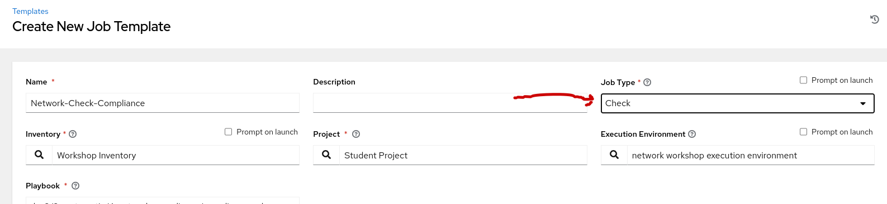
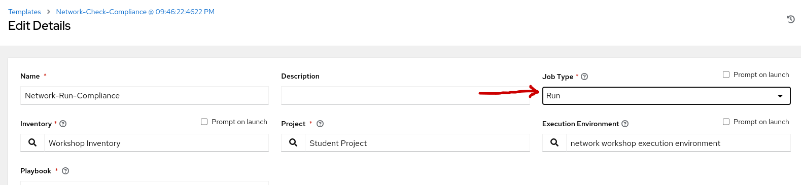
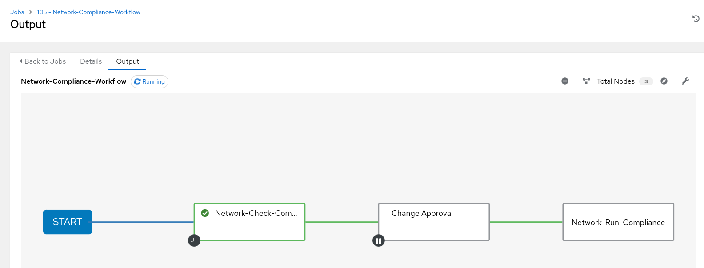
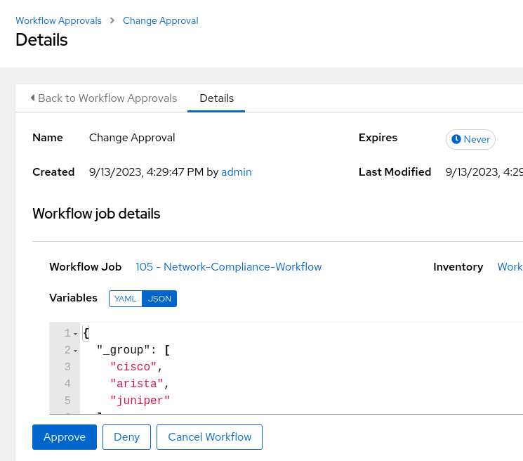
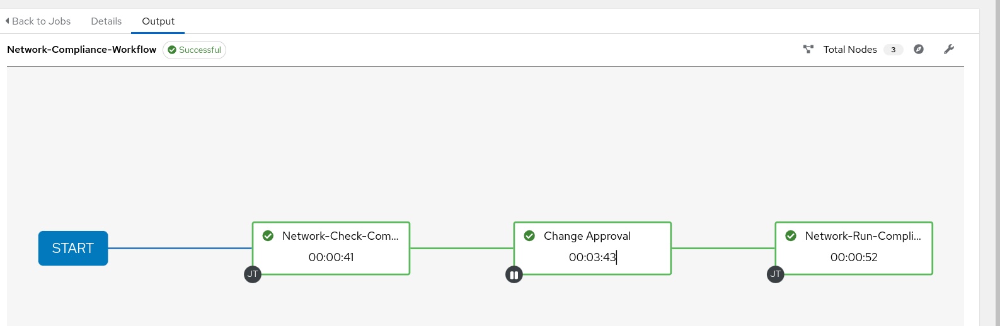
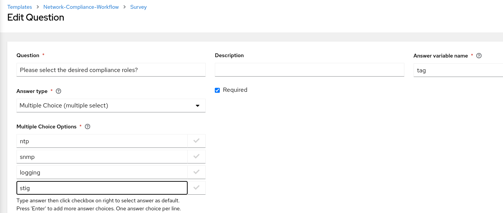
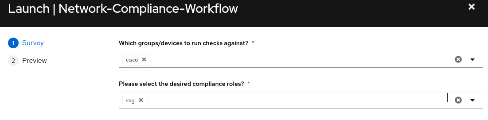

## Return to Demo Menu
 - [Menu of Demos](../README.md)

# Summary of steps
1. Collect Backup configurations from routers and save them to Gitea branches
2. Verify Branches in Gitea
3. Modify the Routers from the CLI
4. Verify Job-template(s) exist
5. Launch the Network-Intended Job-Template
6. Review the Diff between the backup up configs and the running configs on the routers
7. Launch the Network Restore Job Template
8. Verify how the retore will merge the running configuration back to the original

# Exercise 3 - Network Compliance

[Table of Contents](#table-of-contents)
  - [Step 1 - Run the Workflow](#step-1---run-the-workflow)
  - [Step 2 - Verify the completed workflow](#step-2---verify-the-completed-workflow)
  - [Step 3 - Run the Workflow with Stig](#step3---run-the-workflow-with-stig)

## Objective
Create a Workflow with a `self service survey` to select groups and roles to run compliance checks against. 

## Overview
In this demo you will utilize roles, playbooks, job-templates, surveys, and create a workflow to manage compliance checks for a multi-vendor network. 

### Job-template Parameters:

Check mode will run the playbook to list the before state and the necessary remediation commands but not actually replace the configuration on the targetted devices.

Run mode will replace the needed configurations.

### Step 1 - Run the Workflow
Locate and Launch the Network-Compliance-Workflow. In the survey, select all groups and all compliane roles except for `stig`. Stig will be run afterwards using only the Cisco group.

The initial workflow should run the Network-Compliance-Check node but pause at the approval node. 
1. Review the Network-Compliance-Check job and then approve the approval node.

* click on the change approval node "step"

* click the approve button below

### Step 2 - Verify the completed workflow

1. The completed workflow should look like the following

2. Review the Network-Compliance-Run job

3. Optional, Review the router configs.
For example:
~~~
ssh rtr1

sh run | s ntp
~~~

### Step 3 Run the Workflow with Stig 
Please note this option can only succeed, if selecting only with the Cisco group and only stig for the role in the survey.

Congratulations your stig chaeck completed and your devices are compliant!!!! or at least for now ;-)

## Return to Demo Menu
 - [Menu of Demos](../README.md)

