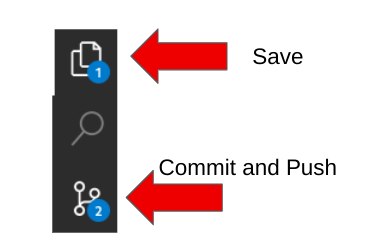
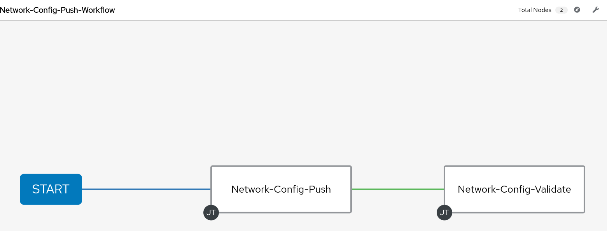

## Return to Demo Menu
 - [Menu of Demos](../README.md)

This needs to be completed
# Summary of steps
1. Review `host_vars/rtr1/bgp_address_family.yaml` and  `host_vars/rtr1/bgp_address_family.yaml` and `host_vars/rtr1/interfaces.yaml`
2. Uncomment the appropriate configurations to make a change.
3. Run the Network-Config-Push-Workflow
4. Review outputs
5. Optional run [text](../scoped_configuration_management) persist to discover YAML configs

# Network Config Push

[Table of Contents](#table-of-contents)
- [Step 1 - Review Host_vars](#step-1-review-host_vars)
- [Step 2 - Uncomment Configs](#step-3-uncomment-configs)
- [Step 3 - Network-Config-Push-Workflow](#step-1-network-config-push-workflow)
- [Step 4 - Review Outputs](#step-4-review-outputs)
- [Step 5 - Optional Persist](#step-5-optional-persist)

## Objective
To demonstrate how to push a configuration to a Cisco router that is joining an existing tunnel based topology. The YAML host_var configuration files are provide for you. See step 5 to learn how to collect the configurations from a brownfield device.

## Overview
In this demo we will use resource modules , jinja2 templates and YAML configuration files to automate introducing a Cisco router into an existing multi-vendor topology. The playbook orchestration is managed with self service surveys and an Ansible AAP workflow.

### Step 1 - Review Host_vars
~~~
/network_demos/network_config_push/host_vars/rtr1
/network_demos/network_config_push/host_vars/rtr2
~~~

### Step 2 - Uncomment Configs
~~~
/network_demos/network_config_push/host_vars/rtr1/bgp_address_family.yaml
/network_demos/network_config_push/host_vars/rtr1/interfaces.yaml
/network_demos/network_config_push/host_vars/rtr2/bgp_address_family.yaml
~~~
For example:
~~~
bgp_address_family:
    address_family:
    -   afi: ipv4
        neighbors:
        -   activate: true
            neighbor_address: 10.200.200.2
        networks:
        -   address: 10.100.100.0
            mask: 255.255.255.0
        -   address: 10.200.200.0
            mask: 255.255.255.0
        -   address: 172.16.0.0
        -   address: 192.168.1.1
            mask: 255.255.255.255
        #-   address: 192.168.3.3   #change
        #    mask: 255.255.255.255  #change
~~~

#### Save and Commit in GIT
Complete the git steps for your change. You must save, commit the file in the VSCode IDE and "sync" push to gitea after fixing the file.

or update from the terminal
~~~
git add --all
git commit -m "deploy"
git push
~~~

### Step 3 - Network-Config-Push-Workflow
Launch the following workflow:

### Step 4 - Review Outputs
Review outputs for network-config-push job-template and network-config-validate job-template

#### Push - Truncated
Here we validate ospf, bgp, and connectivity with pings.
~~~
Identity added: /runner/artifacts/79/ssh_key_data (/runner/artifacts/79/ssh_key_data)
PLAY [Push Cisco Router Configuration with Resource Modules] *******************
TASK [Configure acl_interfaces] ************************************************
ok: [rtr1]
TASK [Configure acls] **********************************************************
ok: [rtr1]

~~~

#### Validated - Truncated
~~~

TASK [Assert that BGP neighbor exists] *****************************************
ok: [rtr1] => {
    "changed": false,
    "msg": "BGP Neighbor to rtr1 tu1-172.18.70.26 is Established"
}
~~~
### Step 5 - Optional Persist
Explore the persist operation from the following demo to learn how to gather an native confgiuration from a brownfield device and convert it to YAML host_var files.

- [Scoped Configuration Management](scoped_configuration_management/README.md)
   * DEMO NAME: scoped_configuration_management
   * [Demo Video](https://youtu.be/1z7NuObWhPE?si=vqB1QCBrMmY2cpor)
   * Validated Content: `network.base` 
   * Operations: Persist, Deploy, Detect, Remediate
   * network.bgp

# Key Takeaways
* Self service and Workflow make it easy to orchestrate multipl playbooks in a simple approach
* Resource modules provide declaritive intent, state, and builtin diffs. 
* Jinja2 templates are useful for configurations not yet covered by resource modules.
* Validated content makes it easy to gather configs from existing decvices to automate subsequent changes.
## Return to Demo Menu
 - [Menu of Demos](../README.md)