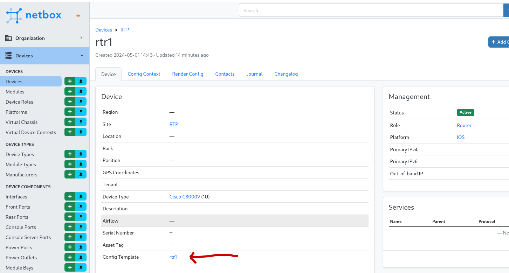

## Return to Demo Menu
 - [Menu of Demos](../README.md)

This needs to be completed
# Summary of steps
1. 

# Network Push

[Table of Contents](#table-of-contents)
- [Step 1 - Netbox Demo Server](#step-1-netbox-demo-server)
- [Step 2 - Network-Netbox-Setup Job Template](#step-2-network-netbox-setup-job-template)
- [Step 3 - Review the Netbox GUI](#step-3-review-the-netbox-gui)
- [Step 4 - Add the API Token](#step-4-add-the-api-token)
- [Step 5 - Review the Netbox Inventory on AAP](#step-5-review-the-netbox-inventory-on-aap)
- [Step 6 - Launch the Network-Netbox-Facts job-template](#step-6-launch-the-network-netbox-facts-job-template)
- [Step 7 - Launch the Network-Netbox-Compare-Configs job-template](#step-7-)
- [Step 8 - Verify Config drift checks by changing the config on rtr1](#step-8-)

## Objective
To integrate 

## Overview
The netbox.netbox 

### Step 1 - Netbox Demo Server
Connect to Netbox Demo server to create and copy an API token
https://netbox-demo.netboxlabs.com/ user=admin pass=admin

* Don't foget to save the api token to a notepad. You will need it throughout this demo.

### Step 2 - Network-Netbox-Setup Job Template
Launch the Network-Netbox-Setup Job Template to configure a device and settings on Netbox.

#### jinja2 template:
One of the configs we are pushing into Netbox is a jinja2 template. Optionally you can create jinja2 templates in Netbox directly. In this demo we are using the netbox collection to configure Netbox from Ansible. 
In either case, jinja2 templates will have many variables that map to the Netbox device configurations in the database. For this demo, we are simply looking for the Netbox device-name to define the hostname for rtr1. These templates are used in Netbox to render configs on devices. When using Ansible to deploy/render device changes, it's important to first check for configuration drift between the running device and the Netbox config/template.

jinja2 snipit:
~~~
 version 17.6
            service timestamps debug datetime msec
            service timestamps log datetime msec
            service password-encryption
            ! Call-home is enabled by Smart-Licensing.
            service call-home
            platform qfp utilization monitor load 80
            platform punt-keepalive disable-kernel-core
            platform console virtual
            !
            hostname {{ device.name | default ('{{ device.name }}') }}
            !         
            boot-start-marker
            boot-end-marker
            !
            !
            vrf definition GS
             rd 100:100
~~~

### Step 3 - Review the Netbox GUI 
Review the Netbox GUI (devices, templates etc)
- Look at the c8000v device type created by the Network-Netbox-Setup job template in the Netbox GUI

### Step 4 - Add the API Token
Add the API Token to Netbox inventory source to sync with Netbox as a dynamic inventory
Update the source-nbox "NETBOX_TOKEN" source variable and save.

### Step 5 - Review the Netbox Inventory on AAP
You will notice several devices from the Netbox Sandbox. Search for the host rtr1 from RHDP. rtr1 is also in group sites_rtp.

### Step 6 - Launch the Network-Netbox-Facts job-template 
Launch the Network-Netbox-Facts job-template to demonstrate using the Inventory for rtr1.  Click on the "Gather all facts" task to look at the JSON and see what was gathered.

### Step 7 - Launch the Network-Netbox-Compare-Configs job-template 
Launch the Network-Netbox-Compare-Configs job-template to compare the running config to the netbox rendered config template.

* Note, that every router from RHDP will have different IP addresses, certs etc. These nuances will show as Diffs.

Access the jinja2 template from Netbox
 

### Step 8 - Verify Config drift checks 
Verify Config drift checks by changing the config on rtr1 and relaunching the Network-Netbox-Compare-Configs job-template

* For example, add a new loopback 100 or something simular to simulate an out-of-band (OOB) change. 

# Key Takeaways
* Configure Netbox with AAP as an alternative to the GUI
* Use Netbox as a dynamic inventory source for Ansible
* Comapare Netbox device configs as a source of truth for config drift.
*
## Return to Demo Menu
 - [Menu of Demos](../README.md)