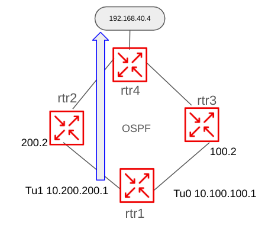
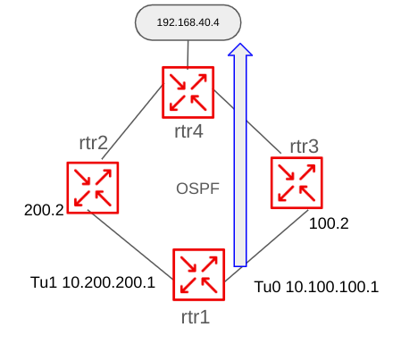

# Event Driven Ansible for Networking

## Return to Demo Menu
 - [Menu of Demos](../README.md)

# Summary of steps
1. Configure a credential for your RHDP lab environment in your EDA env's AAP
2. If not already done, configure a project for EDA in the AAP controller https://gitlab.com/redhatautomation/no_shut_eda_cisco.git to access playbooks for the job-templates
3. If not already done, configure a project for EDA in the EDA controller https://gitlab.com/redhatautomation/no_shut_eda_cisco.git to access rulebooks for the rule activations
4. Ensure you add the password for the ServiceNow to the Network-EDA-Secondary job template.
5. Ensure zookeeper and kafka are runing in your environement
6. Ensure telegraf is running in your environment
7. Create and or activate the rulebook activation in the EDA controller
8. Launch the Network-Backup-Git job template to backup you RHDP configs to rollback to later if needed.
9. Launch the Network-EDA job Template from the RHDP AAP to configure the router topology and IP SLA configuration.
10. SSH to rtr 1 and show current state of IP SLA and static route for 192.168.40.4
11. Shut interface tu1 on rtr1 to simulate taking down the primary ISP link
12. Review EDA, and the job on the RHDP AAP to inspect the changes and copy the servicenow incident number.
13. Access `your` servicenow instance `https://ven05430.service-now.com/` and search for the incident. Note the info passed by AAP to SNOW.
14. ssh to rtr1 and `no shut` interface tu1 to simulate the link restoral
15. Review EDA, and the job on the RHDP AAP to inspect the changes and return to servicenow with the incident to validate the closure of the ticket.
16. On the router validate the primary link is working by showing the state of IP SLA and static route for 192.168.40.4

## Overview
Please note, the above steps will only work for individuals who have access to both a servicenow and an EDA environment. In the future when the RHDP Network Workshop includes an EDA controller these instructions will be updated. The intent will be to run a self run demo using the instruqt servicenow + the RHDP network workshop. 

## Objective
This demo will show how EDA can automate observing network router failures by examining the data from the router's streaming telemetry. EDA is used to automate the opening of a servicenow trouble `incident` ticket to include the results of automated and triaged trouble shooting.The EDA can also open and close tickets to track scenarios where network links go down and are restored without manual intervention. 

### Current State
Primary Link with IP SLA Tracking

### Failover State
Secondary Link 

## Return to Demo Menu
 - [Menu of Demos](../README.md)