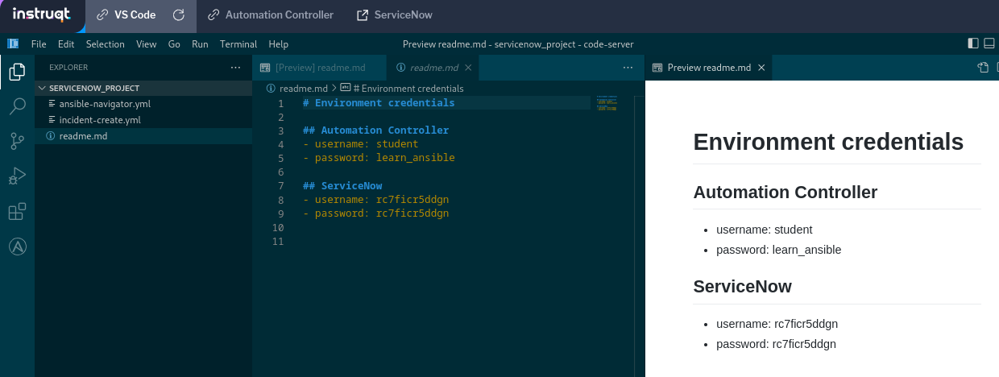

## Return to Demo Menu
 - [Menu of Demos](../README.md)

# Summary of steps
## Incidents
1. Connect to SNOW instuqt lab and launch a new instance 
https://play.instruqt.com/embed/redhat/tracks/getting-started-servicenow-automation?token=em_5ktpLJWtzpbqcDyM
2. Collect the SNOW user/pass for a session
3. Launch the "" Workflow Template and supply the SNOW User/Pass when prompted.
4. Review Workflow Job and note the job-ID to be used for appoval.
5. Access SNOW with user/pass and verify incident-ID
6. Launch the ""fix job-template and provide the Workflow Job-ID and Banner Entry
7. Verify completed Job-template
8. Verify the completed "" Workflow template
9. Verify the closed incident in the Workflow
10. Verify SNOW and search for the closed incident "ticket"
11. Verify the login banner on rtr1
## CMDB and Dynamic Inventory Source with SNOW
1. launch the Network-CMDB-Update job template
2. update the  the snow inventory source and sync
3. validate rtr1 host in the snow inventory
4. launch Network-SNOW-Facts template that uses the SNOW dynamic inventory
5. Verify the details and fact.yml output.

# Network SNOW 
## Incidents
[Table of Contents](#table-of-contents)
- [Step 1 - SNOW user/pass](#step-1-snow-user/pass)
- [Step 2 - Collect user/pass](#step-2-collect-user/pass)
- [Step 3 - Launch the Network-ServiceNow-Workflow Template ](#step-3-launch-the-network-servicenow-workflow-template)
- [Step 4 - Note the Workflow job-ID](#step-4-note-the-workflow-job-ID)
- [Step 5 - SNOW incident](#step-5-snow-incident)
- [Step 6 - Launch the Snow fix job-template](#step-6-launch-the-snow-fix-job-template)
- [Step 7 - Review the Snow fix job-template](#step-7-review-the-Snow-fix-job-template)
- [Step 8 - Verify the completed Snow Workflow template](#step-8-verify-the-completed-snow-workflow-template)
- [Step 9 - Verify the SNOW Closed Incident in the Task](#step-9-verify-the-snow-closed-incident-in-the-task)
- [Step 10 - Verify the SNOW Closed Incident in the SNOW GUI](#step-10-verify-the-snow-closed-incident-in-the-snow-gui)
- [Step 11 - Verify the login banner on rtr1](step-11-verify-the-login-banner-on-rtr1)

## CMDB and Dynamic Inventory
[Table of Contents](#table-of-contents)
- [Step 1 - Launch the Network-CMDB-Update job template](#step-1-launch-the-network-cmdb-update-job-template)
- [Step 2 - Update the Snow inventory source and sync](#step-2-update-the-snow-inventory-source-and-sync)
- [Step 3 - Validate rtr1 host in the SNOW inventory](#step-3-validate-rtr1-host-in-the-snow-inventory)
- [Step 4 - Launch the Network-SNOW-Facts template](#step-4-launch-the-network-snow-facts-template)
- [Step 5 - Verify the details and fact output](#step-5-verify-the-details-and-fact-output)

## Objective
To integrate Ansible workflows with SNOW incident tickets. Also to update the SNOW CMDB with Ansible and use SNOW ITSM as a dynamic inventory source.

## Overview
The SNOW.ITSM collection allows Ansible to open/close incidents, change requsts and pass CMDB data to/from SNOW. In this demo we use a Workflow to check for banner compliance on a Cisco router. If the router is out of compliance a SNOW incident (ticket) is opened. The workflow includes an approval step that requires a banner entry to exist in the router before completing the workflow. THe approval can be accessed directly from the AAP controller or programmatically from an Ansible controller collection. Once completed the workflow closes the incident ticket in SNOW. 

### Step 1 - SNOW user/pass
Launch a new instruqt lab instance instance.
https://play.instruqt.com/embed/redhat/tracks/getting-started-servicenow-automation?token=em_5ktpLJWtzpbqcDyM

1. Launch

2.Wait for about 4 minutes 

### Step 2 - Collect user/pass
1. Access the VSCode README.md file to copy the SNOW user/pass for a SNOW instruqt session.

### Step 3 - Launch the Network-ServiceNow-Workflow Template 
After launching the Workflow template it will fail. 

1. Click on the failed "" job-template and review the output.
~~~
{
  "msg": [
    "INC0013465",
    "Compliance Check Failed sending to Troubleshooting Aproval Node"
  ],
  "_ansible_verbose_always": true,
  "_ansible_no_log": null,
  "changed": false,
  "failed_when_result": true
}
~~~
2. Copy the incident_ID to VSCode or somewhere else. Note, ctrl-c to copy. 

### Step 4 - Note the Workflow job-ID 
Review the Workflow Job and note the job-ID to be used for appoval.

### Step 5- SNOW incident
1. Access SNOW with user/pass and verify `open incident` with the incident-ID

2. Open incident

### Step 6 - Launch the Network-Snow-fix job-template 
1. When prompted, provide the Workflow Job-ID and Banner Entry.

### Step 7 - Review the Network-Snow-fix job-template 
2. Reviewed the changed task
~~~
{
  "changed": true,
  "commands": [
    "banner login @\nSome new Banner Text\n@"
  ],
  "invocation": {
    "module_args": {
      "text": "Some new Banner Text",
      "banner": "login",
      "multiline_delimiter": "@",
      "state": "present"
    }
~~~

### Step 8 - Verify the completed Snow Workflow template
1. The ""fix job-template should programmtically accept the approval step from the Workflow-Template.

2. Review the changed task for the Troubleshoot-Approval node
~~~
{
  "changed": true,
  "invocation": {
    "module_args": {
      "name": "Troubleshoot-Approval",
      "workflow_job_id": 41,
      "action": "approve",
      "controller_host": "student23.qc7s7.example.opentlc.com",
      "controller_username": "admin",
      "controller_password": "VALUE_SPECIFIED_IN_NO_LOG_PARAMETER",
      "validate_certs": false,
      "controller_oauthtoken": "",
      "timeout": 10,
      "interval": 1,
      "request_timeout": null,
      "controller_config_file": null
    }
~~~

Closed
~~~
{
  "changed": true,
  "record": {
    "parent": "",
    "made_sla": "true",
    "caused_by": "",
    "watch_list": "",
    "upon_reject": "cancel",
    "sys_updated_on": "2024-02-02 20:03:29",
    "child_incidents": "0",
    "origin_table": "",
    "task_effective_number": "INC0013465",
    "approval_history": "",
    "skills": "",
    "number": "INC0013465",
    "resolved_by": "f04f503e874842505d60da083cbb3591",
    "sys_updated_by": "VALUE_SPECIFIED_IN_NO_LOG_PARAMETER",
    "opened_by": "f04f503e874842505d60da083cbb3591",
    "user_input": "",
    "sys_created_on": "2024-02-02 19:52:37",
    "sys_domain": "global",
    "state": "closed",
    "route_reason": "",
    "sys_created_by": "VALUE_SPECIFIED_IN_NO_LOG_PARAMETER",
    "knowledge": "false",
    "order": "",
    "calendar_stc": "649",
    "closed_at": "2024-02-02 20:03:29",
    "cmdb_ci": "",
    "contract": "",
    "impact": "low",
    "active": "false",
    "work_notes_list": "",
    "business_service": "",
    "business_impact": "",
    "priority": "5",
    "sys_domain_path": "/",
    "rfc": "",
    "time_worked": "",
    "expected_start": "",
    "opened_at": "2024-02-02 19:52:37",
    "business_duration": "1970-01-01 00:10:49",
    "group_list": "",
    "work_end": "",
    "caller_id": "",
    "reopened_time": "",
    "resolved_at": "2024-02-02 20:03:26",
    "approval_set": "",
    "subcategory": "",
    "work_notes": "",
    "universal_request": "",
    "short_description": "Banner on Rtr CSR 1000v has been updated, marking resolved",
    "close_code": "Solved (Permanently)",
    "correlation_display": "",
~~~
Verify Banner on the Cisco Router

### Step 9 - Verify the SNOW Closed Incident in the Task
Closed
~~~
{
  "changed": true,
  "record": {
    "parent": "",
    "made_sla": "true",
    "caused_by": "",
    "watch_list": "",
    "upon_reject": "cancel",
    "sys_updated_on": "2024-02-02 20:03:29",
    "child_incidents": "0",
    "origin_table": "",
    "task_effective_number": "INC0013465",
    "approval_history": "",
    "skills": "",
    "number": "INC0013465",
    "resolved_by": "f04f503e874842505d60da083cbb3591",
    "sys_updated_by": "VALUE_SPECIFIED_IN_NO_LOG_PARAMETER",
    "opened_by": "f04f503e874842505d60da083cbb3591",
    "user_input": "",
    "sys_created_on": "2024-02-02 19:52:37",
    "sys_domain": "global",
    "state": "closed",
    "route_reason": "",
    "sys_created_by": "VALUE_SPECIFIED_IN_NO_LOG_PARAMETER",
    "knowledge": "false",
    "order": "",
    "calendar_stc": "649",
    "closed_at": "2024-02-02 20:03:29",
    "cmdb_ci": "",
    "contract": "",
    "impact": "low",
    "active": "false",
    "work_notes_list": "",
    "business_service": "",
    "business_impact": "",
    "priority": "5",
    "sys_domain_path": "/",
    "rfc": "",
    "time_worked": "",
    "expected_start": "",
    "opened_at": "2024-02-02 19:52:37",
    "business_duration": "1970-01-01 00:10:49",
    "group_list": "",
    "work_end": "",
    "caller_id": "",
    "reopened_time": "",
    "resolved_at": "2024-02-02 20:03:26",
    "approval_set": "",
    "subcategory": "",
    "work_notes": "",
    "universal_request": "",
    "short_description": "Banner on Rtr CSR 1000v has been updated, marking resolved",
    "close_code": "Solved (Permanently)",
    "correlation_display": "",
~~~

### Step 10 - Verify the SNOW Closed Incident in the SNOW GUI
1. Search for the closed incident "ticket" in SNOW
Search

Review

### Step 11 - Verify the login banner on rtr1
~~~
[student@ansible-1 network-demos-repo]$ ssh rtr1
Warning: Permanently added 'rtr1' (RSA) to the list of known hosts.

Some new Banner Text
rtr1#
~~~
## CMDB and Dynamic Inventory Source with SNOW

### Step 1 - Launch the Network-CMDB-Update job template
This template will add rtr1 to the routed devices cmdb group in SNOW.

### Step 2 - Update the Snow inventory source and sync

Sync the Snow Inventory Source to read in from the dynamic inventory. This will require the SNOW credentials which were collected earlier from the Instruqt lab. 

### Step 3 - Validate rtr1 host in the SNOW inventory

### Step 4 - Launch  the Network-SNOW-Facts template 
This job template uses the SNOW dynamic inventory

### Step 5 - Verify the details and fact output

Details:

The output from facts.yml
~~~
{
  "ansible_facts": {
    "ansible_network_resources": {},
    "ansible_net_gather_network_resources": [],
    "ansible_net_gather_subset": [
      "default"
    ],
    "ansible_net_system": "ios",
    "ansible_net_model": "C8000V",
    "ansible_net_image": "bootflash:packages.conf",
    "ansible_net_version": "17.06.06a",
    "ansible_net_hostname": "rtr1",
    "ansible_net_api": "cliconf",
    "ansible_net_python_version": "3.9.18",
    "ansible_net_iostype": "IOS-XE",
    "ansible_net_operatingmode": "autonomous",
    "ansible_net_serialnum": "9KPPVBQ822V"
  },
~~~

# Key Takeaways
* AAP can automatically open and close tickets in SNOW
* AAP can update the CMDB info in SNOW
* SNOW can launch Job Teplates and Workflows in AAP
* SNOW can provide a dynamic inventory source for AAP

## Return to Demo Menu
 - [Menu of Demos](../README.md)