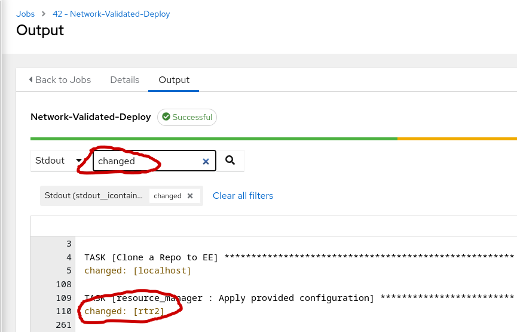
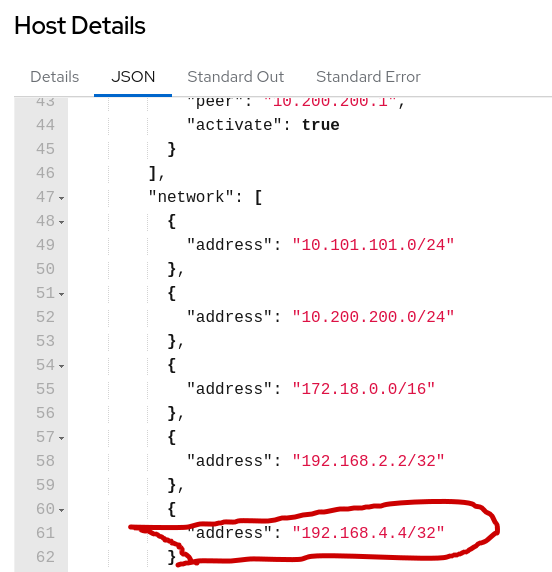
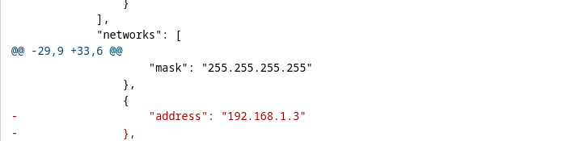

## Return to Demo Menu
 - [Menu of Demos](../README.md)

# Summary of steps
1. Run the Network-Validated-Persist job-template
2. Review the /home/student/scoped_configuration_management/host_vars 
3. Modify host_vars/rtr1.yml to add the network 192.168.3.3 mask 255.255.255.255
4. Modify host_vars/rtr2.yml to add the network 192.168.4.4/32 
5. Commit and Push change to Gitea
6. Run the Network-Validated-Deploy job-template
7. Validate changed in output
8. SSH to rtr1 to add a mistaken configuration
9. Run the Network-Validated-Detect job-template
10. Verify Configuration Drift
11. Run the Network-Validated-Remediate job-template
12. Verify Changed removed the mistaken network prefix.

# Scoped Configuration Management with Validated Content (Roles)

[Table of Contents](#table-of-contents)
- [Step 1 - Persist](#step-1-persist)
- [Step 2 - Deploy](#step-2-deploy)
- [Step 3 - Detect](#step-3-detect)
- [Step 4 - Remediate](#step-4-remediate)

## Objective
Launch `job-templates` that use playbooks developed with `validated content` for networks. The main use case is to establish a single `source of truth` for your network environment. The validated content will allow you to gather facts from brownfield devices to simplify creating a single source of truth mapped to the `inventory host_vars`. With a SSOT in mind, we can easily manage `configuration drift` and accept or remediate changes using intelligent roles from th validated content for networks collection.

## Overview
The Ansible validated content for networks `network.base` focuses on abstract platform-agnostic network automation and enhances the experience of resource module consumption by providing production-ready content. This network base content acts as the core to the other network validated content, such as `network.bgp` and `network.interfaces`.   

### Step 1 - Persist
The resource_manager role uses the `persist action` to get the facts for a given resource and store it as inventory host_vars. 

1. Review a job-template named `Network-Validated-Persist`.

2. Review the `persist.yml` playbook located `scope_config_management/persist.yml`
- Notice how the resource modules are listed in the `vars/resource` for the play. In turn, the resource_manager role will render a hostvars/.yml file or each resource entry. For this demo in particular, we are using shell commands the ansible.scm collection to customize saving the files to the main branch of the git repo. Alternatively, the scm parameter for the resouce_manager role could checkout and push files to a new branch each time.    

- Notice that this playbook includes the role resource_manager. There is no local roles folder in this exercise. The network.base collection is installed in our execution environement container. How does ansible locate this resource_manager role that is included in a collection?
```
ansible.builtin.include_role:
        name: resource_manager
```
In the root of the ansible-network-automation-workshop-201 project directory there is an ansibl.cfg file. In this file we created a roles_path to the network.base validated collection from the EE.
```
roles_path = /usr/share/ansible/collections/ansible_collections/network/base/roles/
```

3. Launch the `Network-Validated-Persist` job template and review the output.

4. From the VSCode terminal:
~~~
git pull
~~~
5. Verify the host_vars entries for each of the four routers in scoped_config_mangement/host_vars/` of your student-repo project.
* Verify from VSCode
~~~
[student@ansible-1 student-repo]$ ls  scoped_config_management/host_vars/
rtr1  rtr2  rtr3  rtr4
~~~

### Step 2 - Deploy
The network.bgp.run role uses the Deploy operations to apply changes to the listed resources. The `deploy` works well for additions to the device's configuration because it uses the state of merged. The state of merged will not overwrite any existing configurations.

1. Add a new BGP network prefix "192.168.3.3" mask "255.255.255.255" for rtr1 to the "scoped_config_mangement/hostvars/rtr1/bgp_address_family.yaml" configuration file. and 
"192.168.4.4/32 entry to the "scoped_config_mangement/hostvars/rtr2/bgp_address_family.yaml" configuration file. These entries will advertise the Loopback0 from rtr3 and rtr4.

- Example for rtr2
~~~
bgp_address_family:
    address_family:
    -   afi: ipv4
        neighbor:
        -   activate: true
            peer: 10.200.200.1
        network:
        -   address: 10.101.101.0/24
        -   address: 10.200.200.0/24
        -   address: 172.18.0.0/16
        -   address: 192.168.2.2/32
        -   address: 192.168.4.4/32
    as_number: '65001'
~~~
Example for rtr1:
~~~
networks:
        -   address: 10.100.100.0
            mask: 255.255.255.0
        -   address: 10.200.200.0
            mask: 255.255.255.0
        -   address: 10.250.1.0
            mask: 255.255.255.0
        -   address: 172.16.0.0
        -   address: 192.168.1.1
            mask: 255.255.255.255
        -   address: 192.168.3.3
            mask: 255.255.255.255
~~~ 

2. Complete the git steps for your change. You must save, commit the file in the VSCode IDE and "sync" push to gitea after fixing the file.


or update from the terminal
~~~
git add --all
git commit -m "deploy"
git push
~~~

3. The playbook `deploy.yml` in `scoped_config_management/` 
- Note the simularity to the persist.yml but this time the operation is "deploy". 

4. Launch the Network-Validated-Deploy job-template. After the deploy.yml completes, ensure that the playbook "changed" adds the network prefix "192.168.4.4 and 192.168.3.3"


- From the stdout filter input "changed" and locate rtr2
 

- Click on changed to take a look at the json output. Locate the 192.168.4.4/32 in the `after` output from the module.
 

- rtr1 will look like the following
~~~
],
  "before": {
    "as_number": "65000",
    "address_family": [
      {
        "afi": "ipv4",
        "networks": [
          {
            "address": "10.100.100.0",
            "mask": "255.255.255.0"
          },
          {
            "address": "10.200.200.0",
            "mask": "255.255.255.0"
          },
          {
            "address": "172.16.0.0"
          },
          {
            "address": "192.168.1.1",
            "mask": "255.255.255.255"
          }
        ],
        "redistribute": [
          {
            "ospf": {
              "process_id": 1
            }
          }
        ],
        "neighbors": [
          {
            "neighbor_address": "10.200.200.2",
            "activate": true
          }
        ]
      }
    ]
  },
  "after": {
    "as_number": "65000",
    "address_family": [
      {
        "afi": "ipv4",
        "networks": [
          {
            "address": "10.100.100.0",
            "mask": "255.255.255.0"
          },
          {
            "address": "10.200.200.0",
            "mask": "255.255.255.0"
          },
          {
            "address": "172.16.0.0"
          },
          {
            "address": "192.168.1.1",
            "mask": "255.255.255.255"
          },
          {
            "address": "192.168.3.3",
            "mask": "255.255.255.255"
          }
        ],
        "redistribute": [
          {
            "ospf": {
              "process_id": 1
            }
          }
        ],
        "neighbors": [
          {
            "neighbor_address": "10.200.200.2",
            "activate": true
          }
        ]
      }
    ]
  },
  ~~~
       
### Step 3 - Detect
The resource_manager role and other related roles such ad network.bgp.run use the detect operation to manage configuration drift. For instance is someone were to add an entry from the CLI that differs from the SSOT `host_vars` then the validated role would fail and call out the Diff.

1. Access rtr1 from the VSCode terminal and ssh

~~~
ssh rtr1
~~~

2. Use the CLI to add a network prefix to rtr1 for rtr3's loobback0 that is a mistake. Sometimes OOB changes made from the CLI are prown to mistakes. Ooops you just fat fingered it....

~~~
config t
router bgp 65000
address-family ipv4 
network 192.168.1.3 
end
~~~

5. Launch the `Network-Validated-Detect` and note the configuration drift for rtr1.

The rtr1's running config is the before diff in red. The 192.168.1.3 entry is drift from our host_vars (SSOT) becuase it was configured OOB and isn't present in the host_vars.

 

### Step 4 - Remediate
The resource_manager role and other related roles such ad network.bgp.run use the remediation action to overrite (add or remove) configuration that are not reconsiled with the host_vars yaml files. In this demo the host_vars files are our single source of truth (SSOT).

1. Launch the `Network-Validated-Remediate` job-template
Ensure that the playbook removes the "errored" 192.168.1.3 network prefix mistake to rtr1 and "changes" adds the network prefix "192.168.3.3 to rtr1. 

2. Review the changed entry for rtr1 to validate the 192.168.1.3 entry was successfully removed.


Congratulations the Validated network.base collection has sucessfully reconciled your routers with the `host_vars` source of truth!  

## Return to Demo Menu
 - [Menu of Demos](../README.md)

